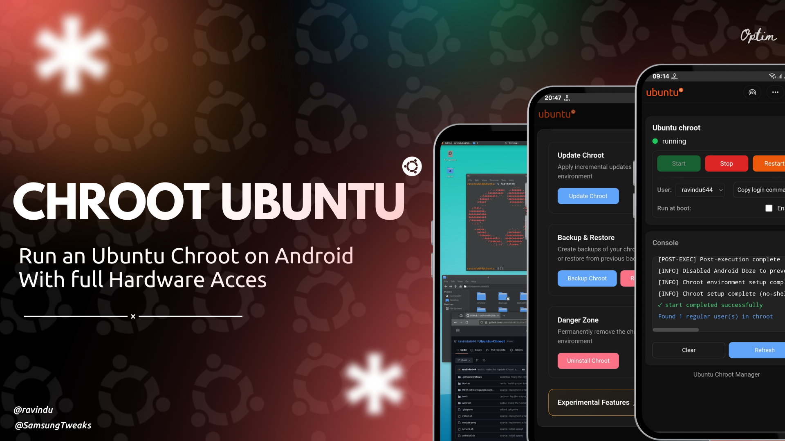
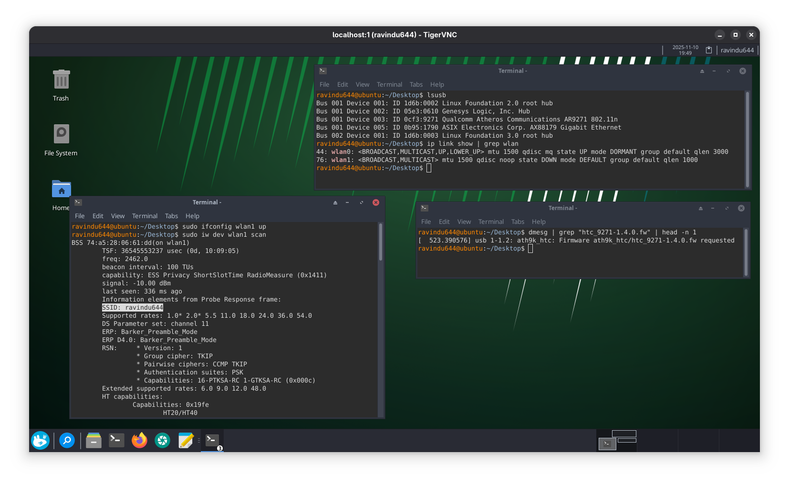
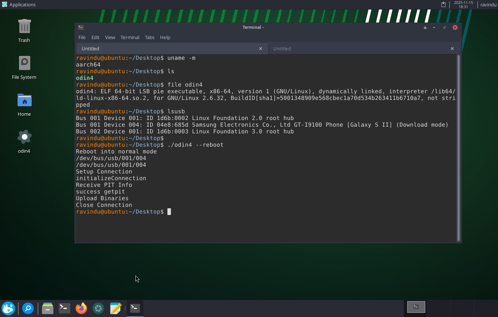
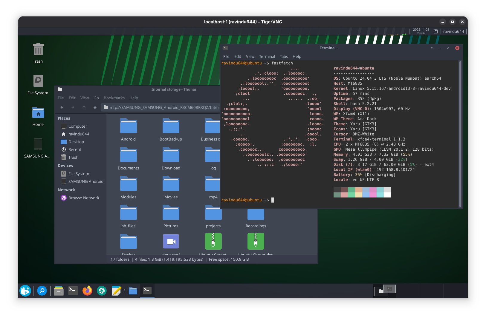
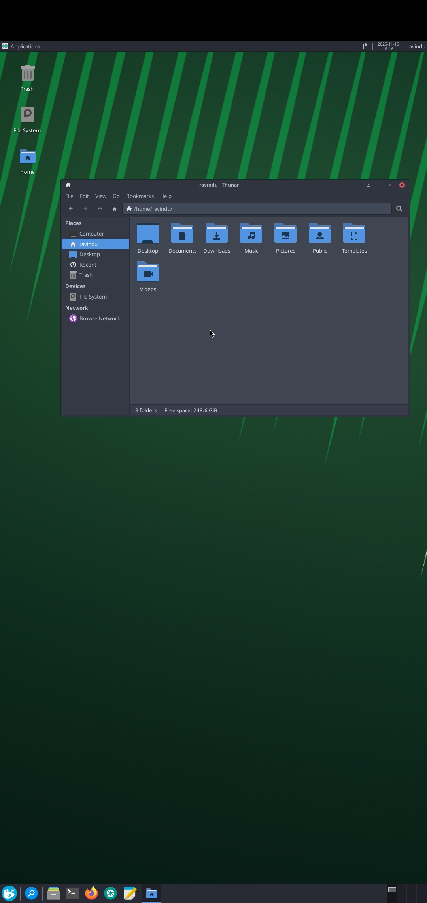
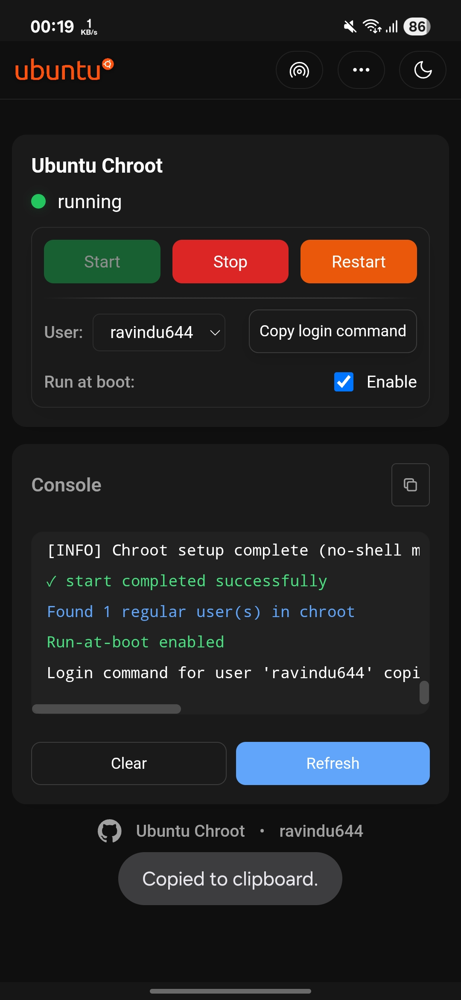
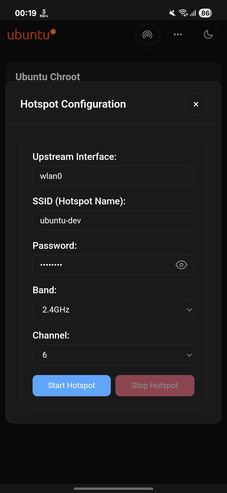
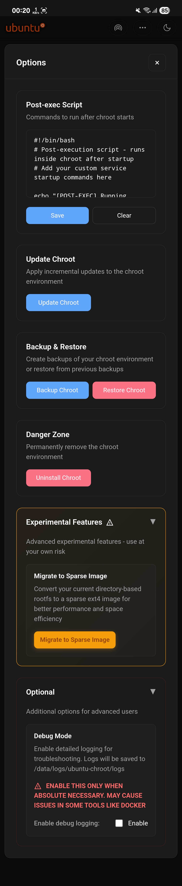

[](https://github.com/ravindu644/ubuntu-chroot/releases/latest)
[](https://t.me/SamsungTweaks)
[](./LICENSE)
[](#requirements)
[](#why-this-is-different)

---

# 🟠 Ubuntu-Chroot

A comprehensive Android Linux environment featuring **Ubuntu 24.04** with a built-in WebUI Control Panel, Beautiful desktop environment, advanced namespace isolation, and in-built development tools for a seamless Linux desktop experience on Android - **with full hardware access and x86_64 emulation**.

#### Quick Navigation

- [Requirements](#requirements)
- [Why This Is Different](#why-this-is-different)
- [Installation](#installation)
- [Usage](#usage)
- [Experimental Features](#experimental-features)
- [Kernel Requirements (Optional)](#kernel-requirements)
- [Credits](#credits)

<a id="requirements"></a>
## 👀 Requirements

- Android device with arm64 architecture
- Unlocked bootloader
- Rooted with APatch/KernelSU
  - Magisk is not supported due to **TTY issues below version 29**. If using Magisk, use a version below v29.

<a id="why-this-is-different"></a>
## ❔ Why This Is Different

**Advanced Namespace Isolation**  
- Utilizes Linux namespaces (mount, PID, UTS, IPC) for true namespace isolation. Unlike basic chroot setups, this creates separate filesystem mounts, process IDs, hostnames, and IPC spaces - preventing interference between the chroot and Android host.<sup>[<a href="#01-core-namespace-support-required-for-isolation">1</a>]</sup>

  <details>
  <summary>Process isolation demonstration</summary>
  
  <p align="center">
    
    <br><em>Illustration of isolated namespaces</em>
  </p>
  </details>

> [!TIP]
>
> **Why Namespaces Matter:**
>
> Traditional chroot only changes the root directory. **Namespaces create isolated environments,** ensuring processes inside the chroot cannot see or affect host system processes, hostnames, or IPC resources.
>
> This allows full Linux services to run without conflicts, security risks, or performance loss.

**Full Hardware Access**  
- Complete access to all hardware features of your Android device, including WiFi adapters, ADB, Odin, and more.<sup>[<a href="#02-essential-filesystems-for-hardware-access">2</a>]</sup>

  <details>
  <summary>Using an external WIFI adapter inside chroot</summary>
  
  <p align="center">
    
    <br><em>Example tools running with full device access</em>
  </p>
  </details>

**x86_64 Emulation**  
- Preconfigured x86_64 emulation enables you to run x86_64 applications and binaries directly on your Android device with full hardware access.<sup>[<a href="#03-running-x86_64-binaries-natively">3</a>]</sup>

  <details>
  <summary>Odin4 x86_64 running with full hardware access</summary>
  
  <p align="center">
    
    <br><em>Rebooting a phone in Download Mode using x86_64 Odin4 on an ARM64 device</em>
  </p>
  </details>

**"It Just Works" Philosophy**  
- No complex terminal commands required. The desktop environment starts automatically when the chroot launches, and most developer tools are preconfigured and ready to use out of the box.

**Containerization Ready**  
- When you flash the module, it extracts the Ubuntu rootfs to `/data/local/ubuntu-chroot`, which the backend uses as the installed rootfs.

- Under **Experimental Features** in the WebUI, you can migrate your directory-based chroot to an ext4 sparse image, containerizing your environment into a single `.img` file.
- The Linux environment runs on an ext4 image outside Android partitions, benefiting from improved I/O, caching, and flexibility.
- You can freely shrink, grow, and FSTRIM your sparse image after migration.
- A sparse image can be created at any size (even 1TB) but only consumes real storage as data is written - an efficient storage method for your Linux environment.

**Seamless Desktop Experience**  

<details>
<summary><strong>📸 Desktop Screenshots (click to expand)</strong></summary>

<p align="center">
  
  <br><em>Landscape mode</em>
</p>

<p align="center">
  
  <br><em>Portrait mode</em>
</p>

</details>

- A complete Linux desktop experience on Android, capable of running GUI applications smoothly.<sup>[<a href="#04-gui-applications-support">4</a>]</sup>

**Integrated Dual-Band Hotspot**  
- Native WiFi hotspot functionality supporting both 2.4GHz and 5GHz bands. Automatically configures `hostapd` and DHCP services within the chroot environment for instant `localhost` sharing.

> **💡 Example**:
> 
> Use the GUI running on your phone and project it to another large screen with near-zero latency.

**Incremental OTA Updates**  
- Version-tracked incremental updates preserve user data and configurations across upgrades, eliminating the need for full reinstallation.

**Backup and Restore**  
- Back up your chroot environment to a compressed archive and restore it later, or transfer it to another device.

**Post-Exec Scripts and "Run on Boot"**  
- Define scripts to run automatically when the chroot boots.

> **💡 Example**:
> 
> Enable "Run on boot" and reboot your phone - the chroot will automatically start (even while locked), executing your post-exec script so you can host bots, SSH, or background services effortlessly.

**Modern WebUI**  
- Access and manage your chroot environment from KernelSU/APatch in-built WebUI.

<details>
<summary>WebUI screenshots</summary>

<table>
<tr>
  <td align="left" valign="top">
    <br><em>Main screen</em>
  </td>
  <td align="left" valign="top">
    <br><em>Hotspot settings</em>
  </td>
  <td align="left" valign="top">
    <br><em>Options panel</em>
  </td>
</tr>
</table>
</details>

<a id="installation"></a>
## 🚀 Installation

1. Download the latest release from [GitHub releases](https://github.com/ravindu644/ubuntu-chroot/releases)
2. Flash the ZIP file using APatch/KernelSU managers
3. Reboot your device

<a id="usage"></a>
## 🧑‍💻 Usage

1. Access the chroot control panel using APatch/KernelSU's built-in WebUI
2. On the first installation, you have to set up your user account to access GUI functionality (VNC/RDP):
   - Start the chroot from the WebUI
   - Copy the login command
   - Paste it in Termux and complete the user account setup
   - Return to the WebUI and click "Restart" to apply changes
3. You can now log in as the created user via:
   - **CLI**: Copy the login command and paste it in Termux or any other terminal emulator, including ADB Shell
   - **GUI (VNC)**: Use the [AVNC Android app](https://github.com/gujjwal00/avnc) (recommended for best performance)
   - **GUI (RDP)**: Uncomment the `# start_xrdp` line in the Post-exec Script from the WebUI and restart the chroot

> **Note**: There is currently no perfect RDP app for Android. Please create an issue if you find a better option.

<a id="experimental-features"></a>
## 🧪 Experimental Features

**Sparse Image Mode Installation**  
- Edit the [experimental.conf](./experimental.conf) file before installation:
    - Set `SPARSE_IMAGE=true`
    - Define the image size in GB using `SPARSE_IMAGE_SIZE`

**Converting to Sparse Image**

- You can convert your existing directory-based installation to an isolated ext4 sparse image from the WebUI under **Experimental Features**.

<a id="kernel-requirements"></a>
## 🛠 Kernel Requirements

**These configurations are optional**, as 80% are enabled in Android by default. However, to ensure everything works perfectly and achieve maximum potential from this project, these kernel configs should be enabled.

#### 01. Core Namespace Support (Required for Isolation)

```Makefile
CONFIG_NAMESPACES=y
CONFIG_PID_NS=y
CONFIG_UTS_NS=y
CONFIG_MNT_NS=y
CONFIG_IPC_NS=y
```

#### 02. Essential Filesystems for Hardware Access

```Makefile
CONFIG_DEVTMPFS=y
CONFIG_PROC_FS=y
CONFIG_SYSFS=y
```

#### 03. Running x86_64 Binaries Natively

```Makefile
CONFIG_BINFMT_MISC=y
CONFIG_BINFMT_SCRIPT=y
CONFIG_BINFMT_ELF=y
```

#### 04. GUI Applications Support

```Makefile
# IPC mechanisms (required by many apps and daemons)
# KDiskMark and Brave Browser will fail without these
CONFIG_SYSVIPC=y
CONFIG_SYSVIPC_SYSCTL=y
CONFIG_PROC_SYSCTL=y
CONFIG_POSIX_MQUEUE=y
```

#### 05. Docker Support in Chroot

```Makefile
CONFIG_CGROUPS=y
CONFIG_CGROUP_DEVICE=y
CONFIG_MEMCG=y
```

<details>
<summary><strong>Complete Kernel Configuration</strong> (click to expand)</summary>

```Makefile
# Ubuntu Chroot Kernel Configuration
# Copyright (C) 2025 ravindu644 <droidcasts@protonmail.com>
# Note: A custom kernel is not required, but most features
# will be limited without these configurations.

# CRITICAL: Essential for basic chroot functionality

# Core namespace support (required for isolation)
CONFIG_NAMESPACES=y
CONFIG_PID_NS=y
CONFIG_UTS_NS=y
CONFIG_IPC_NS=y

# Essential filesystems
CONFIG_PROC_FS=y
CONFIG_SYSFS=y
CONFIG_DEVTMPFS=y
CONFIG_TMPFS=y
CONFIG_EXT4_FS=y

# QEMU support
CONFIG_BINFMT_MISC=y
CONFIG_BINFMT_SCRIPT=y
CONFIG_BINFMT_ELF=y

# Terminal support (required for login)
CONFIG_UNIX98_PTYS=y
CONFIG_TTY=y
CONFIG_DEVPTS_FS=y

# Basic networking
CONFIG_NET=y
CONFIG_INET=y
CONFIG_UNIX=y

# Threading support
CONFIG_FUTEX=y

# File operations
CONFIG_FILE_LOCKING=y

# IMPORTANT: Common functionality requirements

# IPC mechanisms (required by many apps and daemons)
# KDiskMark and Brave Browser will fail without these
CONFIG_SYSVIPC=y
CONFIG_POSIX_MQUEUE=y

# Device management
CONFIG_DEVTMPFS_MOUNT=y

# Extended filesystem features
CONFIG_TMPFS_POSIX_ACL=y
CONFIG_TMPFS_XATTR=y
CONFIG_EXT4_FS_POSIX_ACL=y
CONFIG_EXT4_FS_SECURITY=y

# Control groups (essential for Docker)
CONFIG_CGROUPS=y
CONFIG_CGROUP_DEVICE=y
CONFIG_MEMCG=y

# Event handling
CONFIG_EPOLL=y
CONFIG_EVENTFD=y
CONFIG_SIGNALFD=y
CONFIG_TIMERFD=y

# File monitoring
CONFIG_INOTIFY_USER=y

# Security
CONFIG_SECCOMP=y
CONFIG_SECCOMP_FILTER=y

# Networking features
CONFIG_IPV6=y
CONFIG_PACKET=y

# Legacy PTY (for compatibility)
CONFIG_LEGACY_PTYS=y
CONFIG_LEGACY_PTY_COUNT=256

# OPTIONAL: Advanced features and specific use cases

# Advanced cgroup controllers
CONFIG_CGROUP_CPUACCT=y
CONFIG_CGROUP_SCHED=y
CONFIG_CGROUP_FREEZER=y
CONFIG_CGROUP_PIDS=y
CONFIG_MEMCG_SWAP=y

# Overlay filesystem (for Docker-like functionality)
CONFIG_OVERLAY_FS=y

# FUSE (for userspace filesystems like sshfs, AppImage)
CONFIG_FUSE_FS=y

# Firmware loading
CONFIG_FW_LOADER=y
CONFIG_FW_LOADER_USER_HELPER=y
CONFIG_FW_LOADER_COMPRESS=y

# Loop devices (for mounting disk images)
CONFIG_BLK_DEV_LOOP=y

# Async I/O (for database servers and high-performance apps)
CONFIG_AIO=y

# System control interface
CONFIG_PROC_SYSCTL=y
CONFIG_SYSVIPC_SYSCTL=y
```

</details>

<a id="credits"></a>
## 🙏 Credits

- [Kali NetHunter project](https://gitlab.com/kalilinux/nethunter) for my own understanding of chroot and sysctl commands
- [Chroot-distro](https://github.com/Magisk-Modules-Alt-Repo/chroot-distro) for the internet connectivity fix in initial versions
- [docker-systemctl-replacement](https://github.com/gdraheim/docker-systemctl-replacement) for [systemctl](./Docker/scripts/systemctl3.py) implementation in chroot
- [optimizer](https://github.com/OptimizerS1) for the cool banner design :)

<a id="license"></a>
## 📜 License

This project is released under the [MIT License](./LICENSE). You are free to use, modify, and distribute it as long as the original copyright notice and license terms are preserved.
